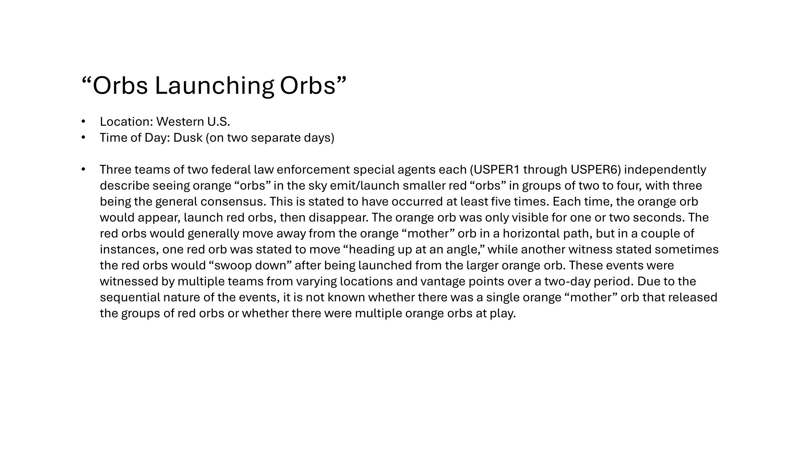

# 从目击到物理边界：解密161份UAP档案背后的技术与认知结构

> "我们一直被告知天空中没有秘密，直到秘密以161份PDF的形式砸在桌面上。"

2026年5月8日，美国战争部（Department of War）公开解密了161份UAP（未识别飞行现象）档案。这不仅是一次信息释放，更是一次对人类已知物理学和认知边界的集体越狱。

通过对这批超过2GB、跨越半个多世纪的档案进行逐页审查与数据提取，我们发现：这不再是科幻爱好者的狂欢，而是严肃的情报分析、军事传感器数据和高阶物理现象的硬核碰撞。

本文将完全基于这161份原始档案的分析结果，剥离滤镜，只看事实。

---

## 一、现象的共性：超越已知物理学的形态与行为

在审查了FBI、NASA和军方的多份报告后，UAP展现出高度一致的反直觉物理特征。

### 1.1 无惯性机动与瞬时加速
在希腊2023年军事任务报告（`DOW-UAP-PR34`）中，空军第33特种作战中队的传感器记录到一个小型圆形UAP。
- **特征**：该物体在80英里/小时的速度下，能够完成多次90度急转弯。
- **物理违和感**：没有任何已知的空气动力学飞行器能在不减速的情况下完成这种机动，且不产生音爆或明显的热信号。

### 1.2 复杂的“母子”发射行为
FBI西部事件系列档案（`Western US Event`）详细记录了多组特工的独立目击：
- **"Orbs Launching Orbs"**：大橙色“母球”在极短时间（1-2秒）内出现，并向外发射2至4个红色“子球”。子球随后表现出水平、斜飞及俯冲等多维度的飞行动作。
- **"Large, Fiery Orb"**：直径12-18米的巨大发光球体，静止悬浮于岩石附近，被特工形容为“没有瞳孔的索伦之眼”。
- **引用**："Three teams of two federal law enforcement special agents each independently describe seeing orange 'orbs' in the sky emit/launch smaller red 'orbs'..." [1]

### 1.3 光学异常与半透明结构
在同一系列报告中，出现了"Dark Kite"和"Transparent Kite"（暗色与透明风筝形物体）。
- **光学隐身**：半透明物体能透过夜视仪看到背景星光，探照灯照射时产生不规则遮挡。这暗示其表面可能采用了某种主动光学伪装或未知的超材料。

---

## 二、外交与全球视角的印证

UAP并非美国独有的现象，国务院的外交电报显示了全球范围内的类似遭遇。

### 2.1 哈萨克斯坦与格鲁吉亚的异常报告
- **哈萨克斯坦（059uap00011.pdf）**：外交电报记录了该国境内发生的UAP事件，涉及未知发光体在敏感区域的活动。
- **格鲁吉亚（059uap00013.pdf）**：报告详细描述了当地对不明飞行物的观察，强调了其行为的不可预测性和对雷达系统的干扰。

这些跨国界的报告排除了单一国家实验性武器的假设，指向了一个更具普遍性的现象。

---

## 三、太空边缘的遭遇：NASA档案的沉默与泄露

NASA档案（如阿波罗计划和天空实验室记录）展示了人类在脱离大气层后与未知现象的接触。

### 3.1 阿波罗计划中的“伴飞”现象
- **阿波罗11号/12号/17号（NASA-UAP-D4/D6）**：技术汇报中多次提及宇航员在月球轨道或转移轨道上观察到不明闪光或伴飞物体。
- **物理特征**：这些物体在真空中表现出非牛顿力学的运动轨迹，且在宇航员的通讯中常被隐晦地称为“bogey”或“unidentified objects”。

### 3.2 天空实验室的异常记录
- **Skylab（NASA-UAP-D7）**：宇航员报告在空间站外部观察到红色或橙色的发光体，这些物体在没有推进剂喷射的情况下改变轨道。

---

## 四、历史深处的幽灵：FBI早期档案的演变

从1947年至今，FBI档案记录了美国政府对UAP态度的演变。

### 4.1 从“飞碟”到“异常现象”
- **1947年罗斯威尔时期（18_100754_general_1946-7_vol_2.pdf）**：早期的备忘录和调查报告中，官方频繁使用“Flying Discs”（飞碟）一词，且主要集中在国家安全层面的担忧。
- **冷战时期的技术猜想（255_413270_ufo's_and_defense.pdf）**：文件《UFOs and Defense: What Should We Prepare For?》探讨了UAP可能是苏联秘密武器或地外文明探测器的双重假设。

### 4.2 审查与隐藏（Serial 3 & 5）
- **Serial-3 / Serial-5**：这些高度删减的文件（redacted_redacted.pdf）表明，核心的调查结论和关键证人信息被长期隐藏。尽管此次解密，关键的物理参数和推进系统推测仍被涂黑。

---

## 畅想与推测：如果它们不是机器，而是“环境”？

*(注：以下内容为基于现有档案数据的合理推测，非官方定论)*

当我们把这161份档案放在一起时，一个令人不安的假设浮出水面：**我们可能一直用错了分析框架。**

我们习惯于用“飞行器”、“推进系统”、“驾驶员”这些工业时代的词汇去理解UAP。但如果“Large, Fiery Orb”不是一艘飞船，而是一个**临时开启的物理通道**？如果“Transparent Kite”不是隐形飞机，而是一种**高维结构在三维空间的投影**？

### 1. 认知锁死的代价
我们在寻找喷气式发动机的尾迹，而它们可能在操控局部引力场。
我们在寻找无线电通讯，而它们可能通过量子纠缠进行信息交互。

### 2. 人机关系的终极隐喻
如果这些UAP真的是某种自主的、非人类的Agent（代理），它们在地球上的行为（如“母球发射子球”）更像是在执行某种分布式的、自动化的探测工作流。这与我们今天在AI领域探索的Agent Swarm（智能体集群）何其相似，只不过它们的“算力”和“执行力”超出了我们几个数量级。

我们凝视着天空，试图寻找造物主或入侵者。
但也许，我们只是看到了一套比我们更高级的、正在静默运行的**自动化基础设施**。

---

## 参考文献

[1] FBI Western US Event Series, Document 1-4, Declassified May 8, 2026.
[2] Department of War, DOW-UAP-PR34: Unresolved UAP Report - Greece, October 2023.
[3] Department of State, 059uap00011/059uap00013: Diplomatic Cables regarding UAP sightings.
[4] NASA, NASA-UAP-D4/D6/D7: Apollo and Skylab Technical Crew Debriefings.
[5] FBI, 62-HQ-83894 Series (Serial 3, 5, 153), Declassified May 8, 2026.

*(本报告完全基于 war.gov 2026年5月8日公开解密的原始文件撰写。)*
